# Deploy App on EKS with AWS AppMesh
---
### 다이어그램
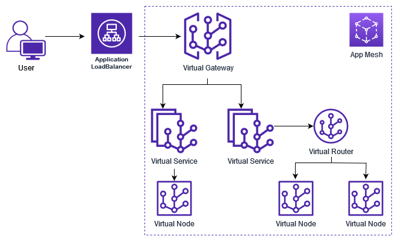

##### Refrence Link
https://aws.amazon.com/blogs/containers/getting-started-with-app-mesh-and-eks/

##### What is Service Mesh?
애플리케이션의 다양한 부분들이 서로 데이터를 공유하는 방식을 제어하는 **방법**이다. 서비스 메시는 각 **서비스(애플리케이션의 각 부분)** 에서 서비스간에 커뮤니케이션을 관리해야하는 다른 시스템과는 다르게 애플리케이션에 구축된 전용 인프라 계층을 통해, 서로 다른 애플리케이션이 얼마나 원활하게 상호작용하는지를 기록 할 수 있어, 더욱 손쉽게 어플리케이션 간의 커뮤니케이션을 활성화 하고, 애플리케이션이 확장됨에 따라 발생하는 커뮤니케이션의 복잡함을 해소시켜 다운 타임을 방지 할 수 있도록 해준다.
##### What is App Mesh?
AWS App Mesh를 사용하면 일관된 가시성 및 네트워크 트래픽 제어 기능을 제공하고 안전한 서비스를 제공하도록 지원하여 서비스를 쉽게 실행할 수 있다. App Mesh를 사용하면 모니터링 데이터 수집 방식이나 서비스 간에 트래픽이 라우팅되는 방식을 변경하기 위해 애플리케이션 코드를 업데이트할 필요가 없다. App Mesh는 모니터링 데이터를 내보내도록 각 서비스를 구성하고, 애플리케이션 전반에 일관된 통신 제어 로직을 구현한다.

---  
### Set up

우선 git clone 한다

```
git clone https://github.com/jeonilshin/EKSwithAppMesh.git
mv EKSwithAppMesh/src/* ./
```

### 구성
#### **인프라 생성**

***ami-xxxxx*** 를 실제 AMI Image ID로 변경합니다.

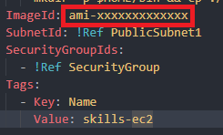

```
aws cloudformation create-stack --stack-name skills-infra --template-body file://aws.yml
```

**Console** ➡️ **EC2** ➡️ **인스턴스**

**skills-ec2** 가 **running** 으로 되어 있는지 확인한다

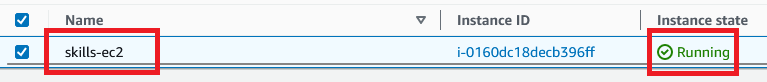

**EC2 인스턴스** 확인 후 인스턴스러 접속 한다

인스턴스로 접속 후, **aws root** 로 로그인하고 아래에 명령어 입력 후 **root** 가 출력 되는지 확인한다

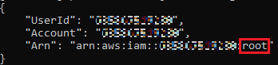


#### **클러스터 생성**

**클러스터** 생성(20-30분 정도 걸린다)

```
chmod +x cluster.sh
./cluster.sh
```

#### **ServiceAccount** 생성하기

```
eksctl create iamserviceaccount \
--cluster skills-cluster \
--namespace appmesh-system \
--name appmesh-controller \
--attach-policy-arn  arn:aws:iam::aws:policy/AWSCloudMapFullAccess,arn:aws:iam::aws:policy/AWSAppMeshFullAccess \
--override-existing-serviceaccounts \
--approve
```

#### **Envoy Proxy** 컨테이너 파드에 배포한다

**helm** 을 사용해서 envoy 설치한다

```
helm repo add eks https://aws.github.io/eks-charts

helm upgrade -i appmesh-controller eks/appmesh-controller \
--namespace appmesh-system \
--set region=ap-northeast-2 \
--set serviceAccount.create=false \
--set serviceAccount.name=appmesh-controller \
--set-string meta.helm.sh/release-namespace=appmesh-system
```

#### **Demo Application** 배포하기

```
git clone https://github.com/aws/aws-app-mesh-examples.git
cd aws-app-mesh-examples/walkthroughs/eks-getting-started
```

```
kubectl create ns yelb
kubectl apply -f infrastructure/yelb_initial_deployment.yaml
```

**yelb** namespace에 있는 파드들 잘 생성 되었있는지 확인

``` kubectl get pods -n yelb ```

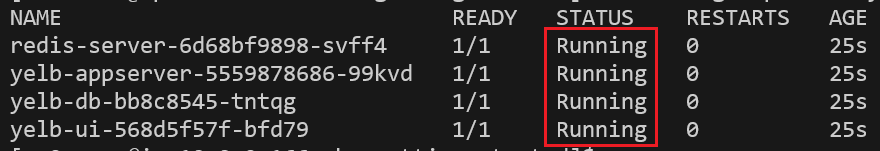

아래 명령어를 입력 후 출력된 **EXTERNAL-IP** 를 기록 한다

``` kubectl get svc -n yelb yelb-ui ```

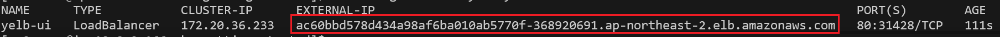

Firefox나 Chrome에 접속하면 아래와 같이 표시 되야 된다

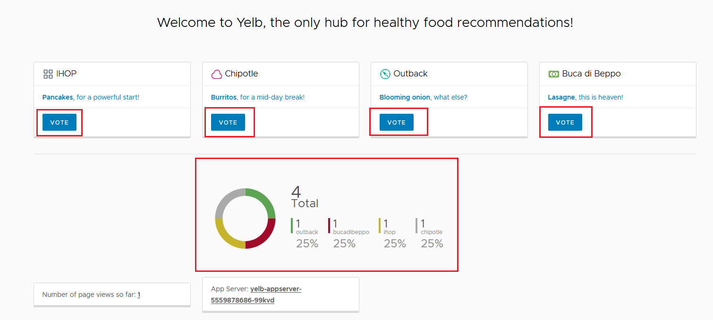

그리고 Vote를 누르면 투표가 정상 적으로 되야 된다

##### **Sidecar Injection** label

Application에 적용될 mesh 이름과 Sidecar Injection Webhook를 활성화하는 Label을 적용한다.

```
kubectl label ns yelb mesh=yelb
kubectl label ns yelb appmesh.k8s.aws/sidecarInjectorWebhook=enabled
kubectl get namespaces --show-labels
```

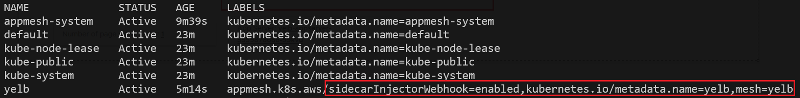

#### **AWS App Mesh 생성하기**

```appmesh.yml```
```
apiVersion: appmesh.k8s.aws/v1beta2
kind: Mesh
metadata:
  name: yelb
spec:
  namespaceSelector:
    matchLabels:
      mesh: yelb
```
``` kubectl apply -f appmesh.yml ```

**Console** ➡️ **App Mesh** ➡️ **Meshes**

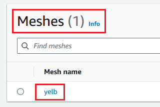

#### **App Mesh 리소스들** 생성하기

```appmesh-redis.yml```
```
apiVersion: appmesh.k8s.aws/v1beta2
kind: VirtualNode
metadata:
  name: redis-server
  namespace: yelb
spec:
  awsName: redis-server-virtual-node
  podSelector:
    matchLabels:
      app: redis-server
  listeners:
    - portMapping:
        port: 6379
        protocol: tcp
  serviceDiscovery:
    dns:
      hostname: redis-server.yelb.svc.cluster.local
---
apiVersion: appmesh.k8s.aws/v1beta2
kind: VirtualService
metadata:
  name: redis-server
  namespace: yelb
spec:
  awsName: redis-server
  provider:
    virtualNode:
      virtualNodeRef:
        name: redis-server
```
``` kubectl apply -f appmesh-redis.yaml ```

**abstract** 모든 **DB** 과 **APP** 서버
``` appmesh-db.yml ```
```
apiVersion: appmesh.k8s.aws/v1beta2
kind: VirtualNode
metadata:
  name: yelb-db
  namespace: yelb
spec:
  awsName: yelb-db-virtual-node
  podSelector:
    matchLabels:
      app: yelb-db
  listeners:
    - portMapping:
        port: 5432
        protocol: tcp
  serviceDiscovery:
    dns:
      hostname: yelb-db.yelb.svc.cluster.local
---
apiVersion: appmesh.k8s.aws/v1beta2
kind: VirtualService
metadata:
  name: yelb-db
  namespace: yelb
spec:
  awsName: yelb-db
  provider:
    virtualNode:
      virtualNodeRef:
        name: yelb-d
```
``` kubectl apply -f appmesh-db.yaml ```

``` appmesh-app.yml ```
```
apiVersion: appmesh.k8s.aws/v1beta2
kind: VirtualNode
metadata:
  name: yelb-appserver
  namespace: yelb
spec:
  awsName: yelb-appserver-virtual-node
  podSelector:
    matchLabels:
      app: yelb-appserver
  listeners:
    - portMapping:
        port: 4567
        protocol: http
  serviceDiscovery:
    dns:
      hostname: yelb-appserver.yelb.svc.cluster.local
  backends:
    - virtualService:
       virtualServiceRef:
          name: yelb-db
    - virtualService:
       virtualServiceRef:
          name: redis-server
---
apiVersion: appmesh.k8s.aws/v1beta2
kind: VirtualRouter
metadata:
  namespace: yelb
  name: yelb-appserver
spec:
  awsName: yelb-appserver-virtual-router
  listeners:
    - portMapping:
        port: 4567
        protocol: http
  routes:
    - name: route-to-yelb-appserver
      httpRoute:
        match:
          prefix: /
        action:
          weightedTargets:
            - virtualNodeRef:
                name: yelb-appserver
              weight: 1
        retryPolicy:
            maxRetries: 2
            perRetryTimeout:
                unit: ms
                value: 2000
            httpRetryEvents:
                - server-error
                - client-error
                - gateway-error
---
apiVersion: appmesh.k8s.aws/v1beta2
kind: VirtualService
metadata:
  name: yelb-appserver
  namespace: yelb
spec:
  awsName: yelb-appserver
  provider:
    virtualRouter:
        virtualRouterRef:
            name: yelb-appserver
```
``` kubectl apply -f appmesh-app.yml ```

App Server의 백엔드는 아래와 같이 볼 수 있다

**Meshes** ➡️ **가상 노드** ➡️ **yelb-appserver-virtual-node** ➡️ **백엔드**

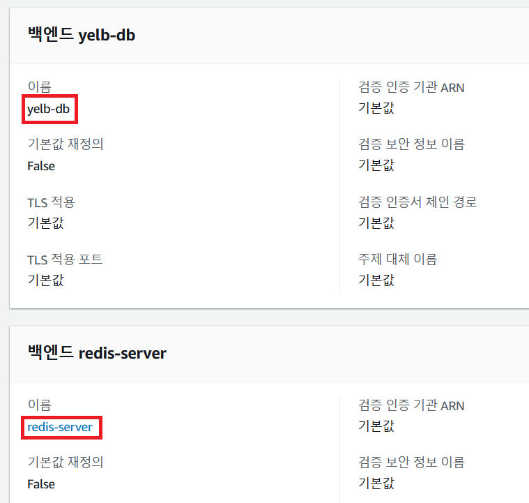

Virtual Router는 아래와 같이 들어오는 요청을 다른 가상 노드로 보내는 가상 라우터의 경로를 만들고 연결한다. 현재는 하나의 가상 노드만 있으므로 해당 Node로 100% 요청을 보내도록 설정 되어 있다

**Meshes** ➡️ **가상 라우터** ➡️ **yelb-appserver-virtual-router** ➡️ **경로**

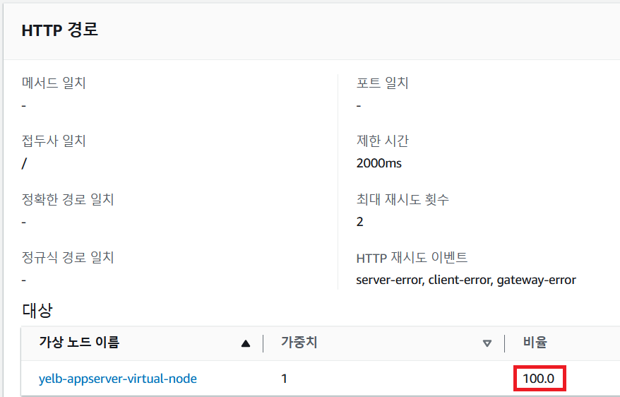

BackEnd 추성화를 다 했으니 이제 FrontEnd를 추성화 해보자

``` appmesh-ui.yml ```
```
apiVersion: appmesh.k8s.aws/v1beta2
kind: VirtualNode
metadata:
  name: yelb-ui
  namespace: yelb
spec:
  awsName: yelb-ui-virtual-node
  podSelector:
    matchLabels:
      app: yelb-ui
  listeners:
    - portMapping:
        port: 80
        protocol: http
  serviceDiscovery:
    dns:
      hostname: yelb-ui.yelb.svc.cluster.local
  backends:
    - virtualService:
       virtualServiceRef:
          name: yelb-appserver
---
apiVersion: appmesh.k8s.aws/v1beta2
kind: VirtualService
metadata:
  name: yelb-ui
  namespace: yelb
spec:
  awsName: yelb-ui
  provider:
    virtualNode:
      virtualNodeRef:
        name: yelb-ui
```
``` kubectl apply -f appmesh-ui.yml ```

mesh의 모든 구성요소가 준비되었으면 이제 sidecar을 주입해주자. 위에서 app mesh controller를 namespace에 설정하였으므로 pod를 새로 띄우면 자동으로 주입된다. 다시 띄어주면 READY가 1/1에서 2/2로 변경되는 것을 확인 할 수 있다

```
kubectl rollout restart deployment -n yelb
kubectl -n yelb get pods
```
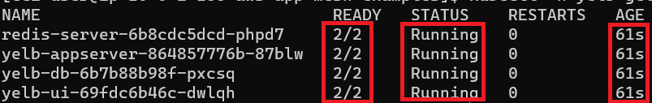

그러면 App Mesh가 정상 적으로 구축이 된 것이다

#### App Server V2으로 트래픽 쉐이핑

``` appmesh-yelb-v2.yml ```
```
apiVersion: appmesh.k8s.aws/v1beta2
kind: VirtualNode
metadata:
  name: yelb-appserver-v2
  namespace: yelb
spec:
  awsName: yelb-appserver-virtual-node-v2
  podSelector:
    matchLabels:
      app: yelb-appserver-v2
  listeners:
    - portMapping:
        port: 4567
        protocol: http
  serviceDiscovery:
    dns:
      hostname: yelb-appserver-v2.yelb.svc.cluster.local
  backends:
    - virtualService:
       virtualServiceRef:
          name: yelb-db
    - virtualService:
       virtualServiceRef:
          name: redis-server
```
``` kubectl apply -f appmesh-yelb-v2.yml ```

서비스 배포 하기
``` yelb-v2-dp.yml ```
```
apiVersion: v1
kind: Service
metadata:
  namespace: yelb
  name: yelb-appserver-v2
  labels:
    app: yelb-appserver-v2
    tier: middletier
spec:
  type: ClusterIP
  ports:
    - port: 4567
  selector:
    app: yelb-appserver-v2
    tier: middletier
---
apiVersion: apps/v1
kind: Deployment
metadata:
  namespace: yelb
  name: yelb-appserver-v2
spec:
  replicas: 1
  selector:
    matchLabels:
      app: yelb-appserver-v2
      tier: middletier
  template:
    metadata:
      labels:
        app: yelb-appserver-v2
        tier: middletier
    spec:
      containers:
        - name: yelb-appserver-v2
          image: codej99/mesh:latest
          ports:
            - containerPort: 4567
```
``` kubectl apply -f yelb-v2-dp.yml ```

#### 버전별 트래픽 라우팅 구성
``` appmesh-appserver-v1-v2.yml ```
```
apiVersion: appmesh.k8s.aws/v1beta2
kind: VirtualRouter
metadata:
  namespace: yelb
  name: yelb-appserver
spec:
  awsName: yelb-appserver-virtual-router
  listeners:
    - portMapping:
        port: 4567
        protocol: http
  routes:
    - name: route-to-yelb-appserver
      httpRoute:
        match:
          prefix: /
        action:
          weightedTargets:
            - virtualNodeRef:
                name: yelb-appserver
              weight: 1
            - virtualNodeRef:
                name: yelb-appserver-v2
              weight: 1
        retryPolicy:
            maxRetries: 2
            perRetryTimeout:
                unit: ms
                value: 2000
            httpRetryEvents:
                - server-error
                - client-error
                - gateway-error
```
``` kubectl apply -f appmesh-appserver-v1-v2.yml ```

Virtual Router가 구성 되는지 확인한다

**Meshes** ➡️ **가상 라우터** ➡️ **yelb-appserver-virtual-router** ➡️ **경로**

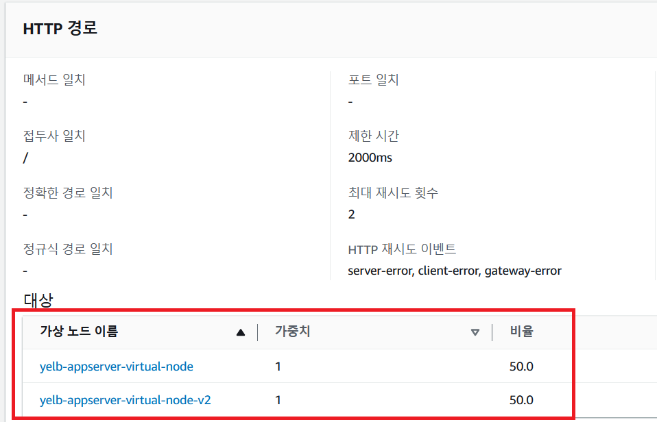

#### 모든 트래픽 App Server V2로 구성

``` appmesh-appserver-v2.yml ```
```
apiVersion: appmesh.k8s.aws/v1beta2
kind: VirtualRouter
metadata:
  namespace: yelb
  name: yelb-appserver
spec:
  awsName: yelb-appserver-virtual-router
  listeners:
    - portMapping:
        port: 4567
        protocol: http
  routes:
    - name: route-to-yelb-appserver
      httpRoute:
        match:
          prefix: /
        action:
          weightedTargets:
            - virtualNodeRef:
                name: yelb-appserver-v2
              weight: 1
        retryPolicy:
            maxRetries: 2
            perRetryTimeout:
                unit: ms
                value: 2000
            httpRetryEvents:
                - server-error
                - client-error
                - gateway-error
```
``` kubectl apply -f appmesh-appserver-v2.yml ```

아래 아키텍처 다이어그램은 두 가지 버전의 yelb-app 서버가 동시에 실행되는 환경을 보여준다:

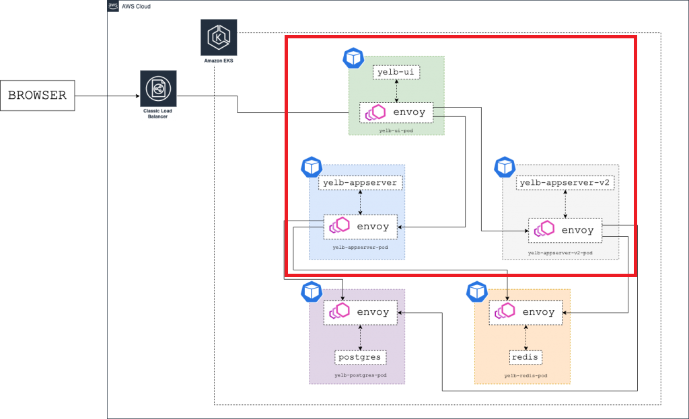

이제 Virtual Gateway를 적용하려면 ns에 label에 gateway 이름을 명시해야한다

```
kubectl label namespace yelb gateway=yelb-gateway
kubectl get namespace --show-labels
```

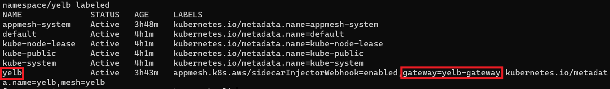

#### 가상 게이트웨이 생성하기
``` yelb-virtual-gw.yml ```
```
apiVersion: appmesh.k8s.aws/v1beta2
kind: VirtualGateway
metadata:
  name: yelb-gateway
  namespace: yelb
spec:
  namespaceSelector:
    matchLabels:
      gateway: yelb-gateway
  podSelector:
    matchLabels:
      app: yelb-gateway
  listeners:
    - portMapping:
        port: 8088
        protocol: http
---
apiVersion: appmesh.k8s.aws/v1beta2
kind: GatewayRoute
metadata:
  name: yelbui-gatewayroute
  namespace: yelb
spec:
  httpRoute:
    match:
      prefix: "/"
    action:
      target:
        virtualService:
          virtualServiceRef:
            name: yelb-ui
---
apiVersion: appmesh.k8s.aws/v1beta2
kind: GatewayRoute
metadata:
  name: yelbapp-gatewayroute
  namespace: yelb
spec:
  httpRoute:
    match:
      prefix: "/api"
    action:
      target:
        virtualService:
          virtualServiceRef:
            name: yelb-appserver
```
``` kubectl apply -f yelb-virtual-gw.yml ```

추상화한 게이트웨이에 대응되는 실제 게이트웨이 서비스를 Kubernetes Cluster에 배포한다. 게이트웨이는 envoy 이미지로 생성하여 NLB로 외부에 오픈한다

``` yelb-gateway.yml ```
```
apiVersion: v1
kind: Service
metadata:
  name: yelb-gateway
  namespace: yelb
  annotations:
    service.beta.kubernetes.io/aws-load-balancer-type: "nlb"
spec:
  type: LoadBalancer
  ports:
    - port: 80
      targetPort: 8088
      name: http
  selector:
    app: yelb-gateway
---
apiVersion: apps/v1
kind: Deployment
metadata:
  name: yelb-gateway
  namespace: yelb
spec:
  replicas: 1
  selector:
    matchLabels:
      app: yelb-gateway
  template:
    metadata:
      labels:
        app: yelb-gateway
    spec:
      containers:
        - name: envoy
          image: 840364872350.dkr.ecr.ap-southeast-1.amazonaws.com/aws-appmesh-envoy:v1.15.0.0-prod
          ports:
            - containerPort: 8088
```
``` kubectl apply -f yelb-gateway.yml ```

아래 명령어를 입력 후 출력된 EXTERNAL-IP 를 기록 한다

``` kubectl get svc yelb-gateway -n yelb ```

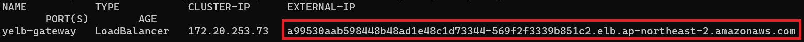

Firefox나 Chrome에 접속하면 아래와 같이 표시 되야 된다

이제 비교 하자면

V2
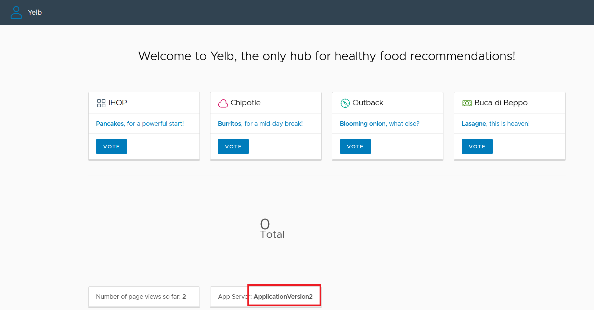

V1
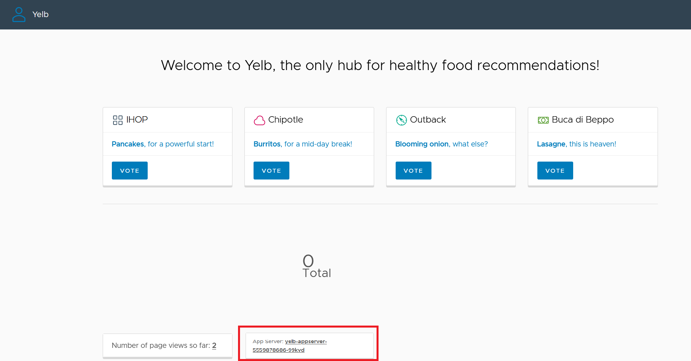

#### Mesh Monitoring / Visualizing

AWSXRayDaemonWriteAccess 정책을 EKS Cluster의 EC2 Auto-Scaling Group에 연결한다

```
export AUTOSCALING_GROUP=$(aws eks describe-nodegroup --cluster-name skills-cluster --nodegroup-name skills-mesh-ng | jq -r '.nodegroup.resources.autoScalingGroups[0].name' | sed 's/-skills-mesh-ng//')

export ROLE_NAME=$(aws iam get-instance-profile --instance-profile-name $AUTOSCALING_GROUP | jq -r '.InstanceProfile.Roles[] | .RoleName')

aws iam attach-role-policy \
--role-name $ROLE_NAME \
--policy arn:aws:iam::aws:policy/AWSXRayDaemonWriteAccess
```

#### App Mesh의 X-Ray Tracing 활성화
```
helm uninstall appmesh-controller -n appmesh-system

helm upgrade -i appmesh-controller eks/appmesh-controller \
--namespace appmesh-system \
--set tracing.enabled=true \
--set tracing.provider=x-ray \
--namespace appmesh-system \
--set region=ap-northeast-2 \
--set serviceAccount.create=false \
--set serviceAccount.name=appmesh-controller

kubectl rollout restart deployment -n yelb
```

#### X-Ray 구성 확인

**CloudWatch** ➡️ **X-Ray** ➡️ **서비스 맵** ➡️ **맵 보기**

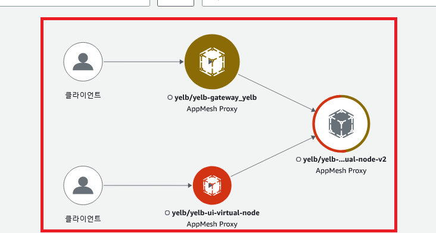

**CloudWatch** ➡️ **X-Ray** ➡️ **서비스 맵** ➡️ **목록 보기**

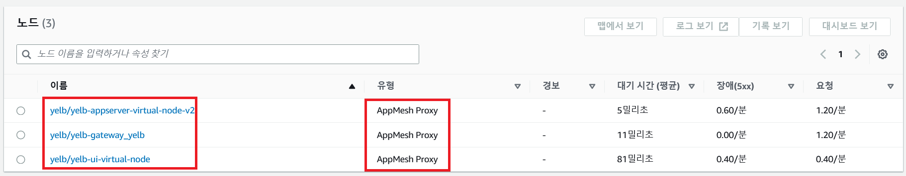

## Clean Up

``` 최대 30분정도 걸림 ```
```
chmod +x ./clean.sh
./clean.sh
```

#### Next Steps & Conclution

You will find [Weave Flagger] helpful if you are interested in automating canary deployments. Flagger allows you to promote canary deployments using AWS App Mesh automatically. It uses Prometheus metrics to determine canary deployment success or failure and uses App Mesh’s routing controls to shift traffic between the current and canary deployment automatically.

Further, some useful links if you want to dive deeper into the topic:

- Check out the [aws-app-mesh-examples] repo on GitHub.
- The [App Mesh Developer] Guide via the docs contain more tips and tricks.

In this post we went through the fundamentals of App Mesh and showed how to place an existing Kubernetes application into a mesh using the open source App Mesh Controller for K8s. You also learned how you can try different deployment techniques by using Virtual Routes to split traffic between two versions of an application. In the next blog, we will show you how you can use App Mesh [Virtual Gateways] to provide connectivity inside and outside the mesh.

You can track upcoming features via the [App Mesh roadmap] and experiment with new features using the [App Mesh preview channel]. Last but not least: do check out [appmeshworkshop.com] to learn more App Mesh in a hand-on fashion and join us on the [App Mesh Slack] community to share experiences and discuss with the team and your peers.

[Weave Flagger]: https://docs.flagger.app/tutorials/appmesh-progressive-delivery
[aws-app-mesh-examples]: https://github.com/aws/aws-app-mesh-examples
[App Mesh Developer]: https://docs.aws.amazon.com/app-mesh/latest/userguide/what-is-app-mesh.html
[Virtual Gateways]: http://Virtual%20gateways
[App Mesh roadmap]: https://github.com/aws/aws-app-mesh-roadmap/projects/1
[App Mesh preview channel]: https://docs.aws.amazon.com/app-mesh/latest/userguide/preview.html
[appmeshworkshop.com]: http://appmeshworkshop.com/
[App Mesh Slack]: https://awsappmesh.slack.com/